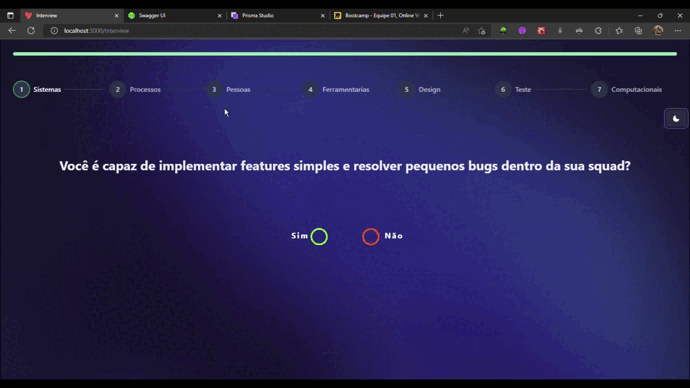

# 👋 Introdução

## Aplicação "Self Awareness"

A aplicação foi criada com o intuito de testes e visualizar a evolução dos profissionais de TI através de testes onde o mesmo possa avaliar as suas competências através de algumas perguntas propostas pelos seus gestores e sobre sua evolução referente a certos processos que o profissional foi adquirindo e melhorando durante suas atividades.

Com a proposta de ser uma aplicação de escopo mais privado para cada setor de sua empresa, toda a parte de informações e de visualizações referem-se ao teste que será apresentado para o profissional após o acesso da plataforma e também na visualização de seu histórico profissional referente aos conhecimentos adquiridos, em que o usuário e os administradores possam visualizar cada resultado dos seus testes passados, podendo fazer uma breve comparação gráfica de sua evolução e sobre a sua hierarquia como profissional de TI.

Referente aos perfis administradores, os mesmos teriam acesso total aos testes que foram realizados por diferentes colaboradores com acesso a plataforma, podendo eles filtrarem os resultados e os testes realizados por nome, função e os tipos de equipes que cada colaborador pertence.

Como obrigatoriedade, os administradores cuidam da parte de aprovação e dos tipos de funções e hierarquias de seus colaboradores através dos resultados de seus testes, podendo assim gerir melhor as funções de seus profissionais dentro de cada projeto.

\_\_\_\_\_\_\_\_\_\_\_\_\_\_\_\_\_\_\_\_\_\_\_\_\_\_\_\_\_\_\_\_\_\_\_\_\_\_\_\_\_\_\_\_\_\_\_\_\_\_\_\_\_\_\_\_\_\_\_\_\_\_\_\_\_\_\_\_\_\_\_\_\_\_\_\_\_\_\_\_\_\_\_\_\_\_\_\_\_\_\_\_\_\_\_

### Como é realizado a avaliação:

O teste é composto de 27 perguntas, divididas entre 5 eixos de avaliação.

Nível pessoal:

* Pessoas -> Focado em avaliar o relacionamento interpessoal dentro e fora da squad.
* Processos -> Focado em avaliar engajamento e organização com os processos definidos pelo time de tecnologia.
* Sistemas -> Focado em avaliar o conhecimento sistêmico organizacional da empresa.
* Influência -> Média ponderada feita entre Pessoas, Processos e Sistemas que avalia o impacto geral do nível pessoal.

Nível Técnico:

* Tecnologia -> Avaliação técnica com os conhecimentos de hard-skills do desenvolvedor.

<figure><figcaption></figcaption></figure>

\_\_\_\_\_\_\_\_\_\_\_\_\_\_\_\_\_\_\_\_\_\_\_\_\_\_\_\_\_\_\_\_\_\_\_\_\_\_\_\_\_\_\_\_\_\_\_\_\_\_\_\_\_\_\_\_\_\_\_\_\_\_\_\_\_\_\_\_\_\_\_\_\_\_\_\_\_\_\_\_\_\_\_\_\_\_\_\_\_\_\_\_\_\_\_

### Visualização dos resultados

Após a realização do teste por parte do usuário, o mesmo é redirecionado para a página de seu perfil onde pode visualizar seu resultado através dos gráficos disponíveis. O colabora assim como seu gestor são notificados pela realização do teste através do site e por seu email cadastrado.

Boa parte do histórico do usuário é integrado com alguns gráficos em que mostra o resultado de todas as categorias dos testes, como também de forma separada e do histórico de testes realizados para comparação de evolução do usuário de forma dinâmica.&#x20;
