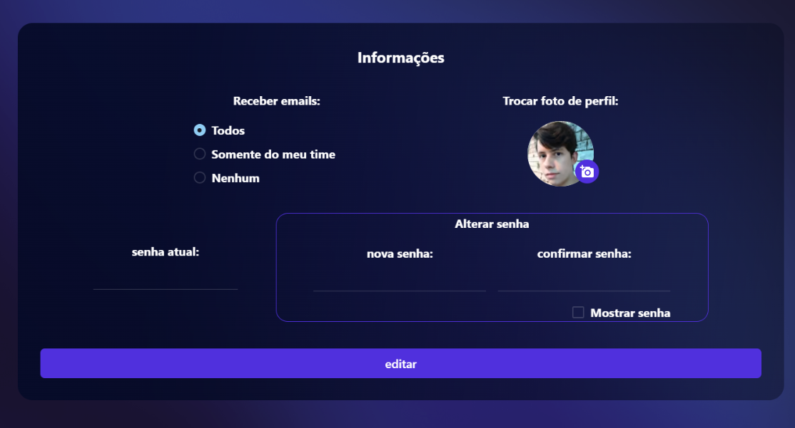

# Administração 🕴

## Introdução

A página de Administração se destina a gerência por parte de usuários autorizados. É por meio desta página que o gestor poderá fazer a avaliação dos testes de seus subordinados, além de poder visualizar em tempo real, atualizações sobre usuários e testes realizados, bem como suas respectivas comparações.

<figure><figcaption><p>Página de Administração</p></figcaption></figure>

## Componentes Integrados


[user-list.md](user-list.md)



[all-user-list.md](all-user-list.md)



[user-comparison.md](user-comparison.md)


## Requisitos Funcionais

|                                           Descrição                                           |                                                       Entradas                                                      |                                         Saídas                                         |                                                          Observações ⭐                                                          |
| :-------------------------------------------------------------------------------------------: | :-----------------------------------------------------------------------------------------------------------------: | :------------------------------------------------------------------------------------: | :-----------------------------------------------------------------------------------------------------------------------------: |
|                          Acessibilidade via Color Mode - White e Dark                         | <p>Evento de clique no primeiro ícone do componente <mark style="color:purple;">AsideMenu</mark></p><p>[☀ - 🌙]</p> |              Alteração na visualização de cores dentro de toda a aplicação             |            O controle do modo de cores ocorre através do context <mark style="color:purple;">ToggleModeStyle</mark>.            |
|                                 Função de Logout da aplicação                                 |             Evento de clique no último ícone do componente <mark style="color:purple;">AsideMenu</mark>             |                     Encerra a sessão do usuário logado na aplicação                    | O encerramento de uma sessão se dá através da exclusão de dados armazenados no <mark style="color:orange;">LocalStorage</mark>. |
| Controle de sessão e context <mark style="color:purple;">Auth</mark> com tratamento via Toast |                                                          -                                                          | <p>(Caso não esteja logado): </p><p>ERROR: "Sessão expirada, faça login novamente"</p> |                                                                ✅                                                                |
|                  Navegação entre páginas de usuário no menu lateral esquerdo                  |       Links de páginas de navegação: Profile, Histórico, Especialidades, Mudar Conta, Histórico, Administração      |                           Retorna página selecionada no menu.                          |                                                                -                                                                |
|                                        Responsividade                                         |                                                          -                                                          |                                            -                                           |                                                                ✅                                                                |

```
Caminho do arquivo: src\pages\Administration
```
