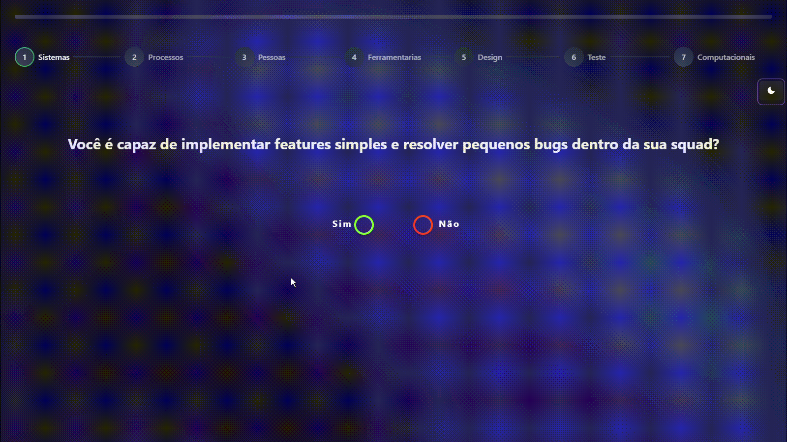

# StepsForm

## Introdução

O componente StepsForm é composto de um formulário por onde serão encaminhadas as respostas do teste para futura avaliação do gestor.

Além disso, ele também é responsável por toda a lógica de condução da avaliação entre os steps com as questões.

## Perguntas do Form

As questões do formulário são recebidas através da API e armazenadas no context <mark style="color:purple;">test.tsx</mark> (`src\contexts\test.tsx`). Para tal, é necessário que haja um usuário logado na aplicação para que seja feita a requisição do teste ao banco de dados.

```typescript
export const TestContextProvider = ({ children }: TestContextProps) => {
  const [test, setTest] = useState<any>({} as any);

  const { logged } = useAuth();

  const handleGetTest = () => {
    let token: any;

    if (typeof window !== "undefined") {
      token = localStorage.getItem("token") || "";
    }

    const headers = {
      headers: {
        Authorization: `Bearer ${token}`,
      },
    };

    api
      .get(`/Test/allTests`, headers)
      .then((res) => {
        setTest(res.data[0]);
      })
      .catch((err) => console.log(err));
  };

  useEffect(() => {
    if (logged) handleGetTest();
  }, [logged]);

  return (
    <TestContext.Provider value={{ test, handleGetTest }}>
      {children}
    </TestContext.Provider>
  );
};

export const useTest = () => useContext(TestContext);
```

Caso as condições sejam satisfeitas, o servidor irá retornar o teste através de um JSON:

```json
{
"system": [
      "Você é capaz de implementar features simples e resolver pequenos bugs dentro da sua squad?",
      "Você desenha e implementa soluções de média e alta complexidade reduzindo débitos técnicos do time?",
      "Você é capaz de subir e controlar sistemas em produção e também monitora a qualidade olhando para SLAs?",
      "Você desenvolve arquitetura para futuras soluções e define SLAs?",
      "Você lidera as soluções técnicas com excelência e cria planos de contingências?"
    ],
    "computationalFundamentals": [
      "Você Conhece e aplica estruturas de dados e multithreading?",
      "Você consegue desenhar a arquitetura de um sistema de complexidade média a alta",
      "Você consegue desenhar uma arquitetura multis sistêmica e para múltiplos times"
    ],
    "person": [
      "Você está sempre aprendendo com os outros e estuda mais quando necessário?",
      "Você sempre ajuda as pessoas do seu time a terem sucesso em seus desafios",
      "Você organiza times, promove feedbacks e intermedeia discussões",
      "Você mentora outros em seu desenvolvimento e já foi coach na construção de PDI",
      "Você gerencia carreiras, expectativas, performances e nível de engajamento do seu time"
    ],
    "process": [
      "Você segue todo o flow (git, CI/CD, Jira..) de desenvolvimento entregando features consistentes em produção?",
      "Você sugere mudanças nos flows com consistência, sempre procurando caminhos para melhorar",
      "Você sempre chama o time para reavaliar os flows, garantindo que todos entendam os benefícios e impactos",
      "Você é o responsável por ajustar os flows do time, escutando feedbacks e guiando através das mudanças",
      "Você define os flows baseado na maturidade, agilidade e disciplina do time"
    ],
    "test": [
      "Você implementa teste unitário e também testa a sua solução manualmente considerando as definições do produto?",
      "Você simula comportamentos dos clientes no seu desenvolvimento, testa além do caminho feliz e analisa o impacto das mudanças",
      "Você implementa teste e2e, de integração que permita avaliar e monitorar o produto"
    ],
    "design": [
      "Você conhece e aplica os princípios do S.O.L.I.D (Ou algum outro pattern definido pelo seu chapter Manager) no seu código?",
      "Você conhece e aplica pelo menos outros 3 princípios de pattern no seu código e ajuda seus colegas de time a escolherem qual o melhor para a solução do problema",
      "Você já ajudou a definir padrões de projetos de times/produtos fora do seu time"
    ],
    "toolshop": [
      "Você conhece o conceito de código limpo (link)? Aplica o conceito em pelo menos 50% do seu código? Conhece e desenvolve seguindo os nossos processos de CI/CD?https://petlove.atlassian.net/wiki/spaces/TEC/pages/351666200/Playbook",
      "Você Constrói códigos modulares e segue os conceitos de código limpo em 80% do seu código?",
      "Você ajuda a definir processos de CI/CD do seu time e da sua área? Ensina seus colegas a importância de um código limpo e cobra isso nos PRs que revisa?"
    ],
}
```

## Sobre: Lógica e Dinâmica do Form&#x20;

Uma vez que o cliente renderize as informações do formulário, o usuário em avaliação terá duas opções de resposta para toda pergunta que for exibida na tela.

Caso o usuário marque "Sim" ele prosseguirá com o teste no Step ativo, indo para a próxima pergunta do eixo.

<figure><figcaption><p>Gif - Option "Sim"</p></figcaption></figure>

Entretanto, caso o usuário marque a opção "Não", ele saltará para o próximo Step da avaliação.

<figure><figcaption><p>Gif - Option "Não"</p></figcaption></figure>

## Form & Submissão

Conforme o usuário responde as questões do teste, suas respostas vão sendo armazenadas em uma variável para posteriormente serem encaminhadas ao servidor e salvas no banco.

```typescript
const respostas = {
  Sistemas: 0,
  Processos: 0,
  Pessoas: 0,
  Ferramentarias: 0,
  Design: 0,
  Teste: 0,
  Computacionais: 0,
};
```

A submissão ocorre ao final da avaliação.

```tsx
const token = localStorage.getItem("token");

const headers = {
  headers: {
    Authorization: `Bearer ${token}`,
  },
};

const data = {
  toolshop: respostas.Ferramentarias,
  design: respostas.Design,
  test: respostas.Teste,
  computationalFundamentals: respostas.Computacionais,
  person: respostas.Pessoas,
  process: respostas.Processos,
  system: respostas.Sistemas,
};

api
  .post("/Result", data, headers)
  .then((response) => {
    setQuantity(0);
    handleReset();
    handleGetUsers();
    toast.success("Resultado enviado com sucesso!");
  })
  .catch((error) => {
    handleReset();
    toast.error("Erro ao enviar resultado!");
  });
}}
```

## Componentes Integrados

* Chackra-UI-Steps -> Navegação entre subdivisões dos eixos de avaliação.
* React Toast -> Tratamento de respostas.

## Requisitos Funcionais

|                   Descrição                  |                                                       Entradas                                                      |                                         Saídas                                         |                                               Observações ⭐                                               |
| :------------------------------------------: | :-----------------------------------------------------------------------------------------------------------------: | :------------------------------------------------------------------------------------: | :-------------------------------------------------------------------------------------------------------: |
|        Envio do teste para o servidor        |                           Campos do teste listados [aqui](stepsform.md#form-and-submissao)                          |                                            -                                           |                                                     ✅                                                     |
| Acessibilidade via Color Mode - White e Dark | <p>Evento de clique no primeiro ícone do componente <mark style="color:purple;">AsideMenu</mark></p><p>[☀ - 🌙]</p> |              Alteração na visualização de cores dentro de toda a aplicação             | O controle do modo de cores ocorre através do context <mark style="color:purple;">ToggleModeStyle</mark>. |
|    Tratamento de respostas via ReactToast    |                                                          -                                                          | <p>ERROR: "Erro ao enviar resultado!"<br>SUCCESS: "Resultado enviado com sucesso!"</p> |                                                     ✅                                                     |
|                Responsividade                |                                                          -                                                          |                                            -                                           |                                                     ✅                                                     |

```
Caminho do arquivo: src\components\Steps\Steps.tsx
```
