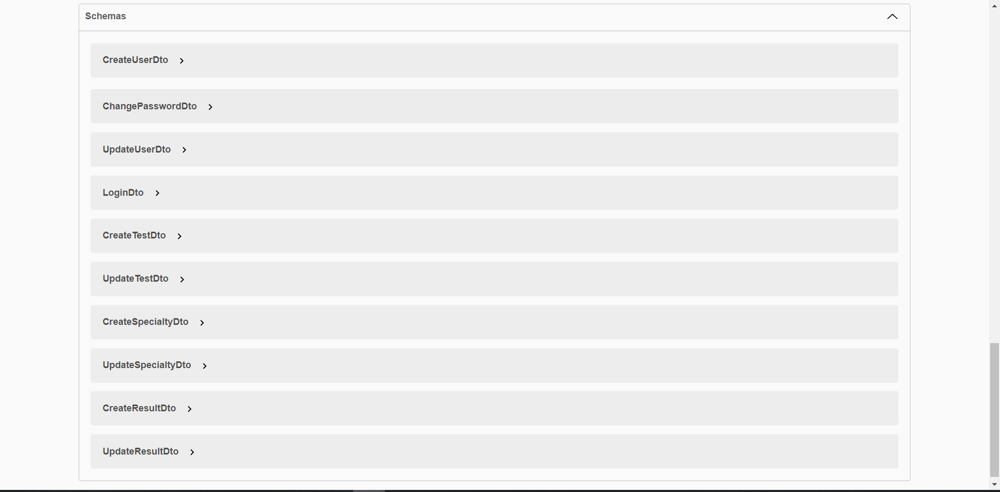
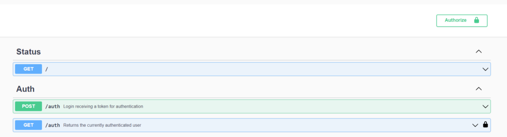
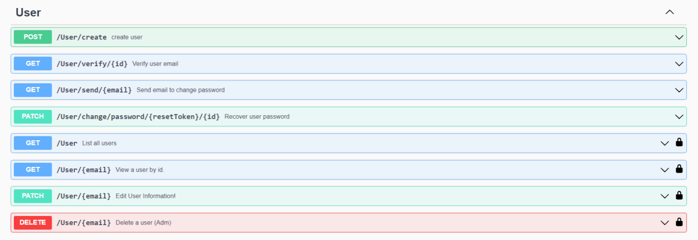
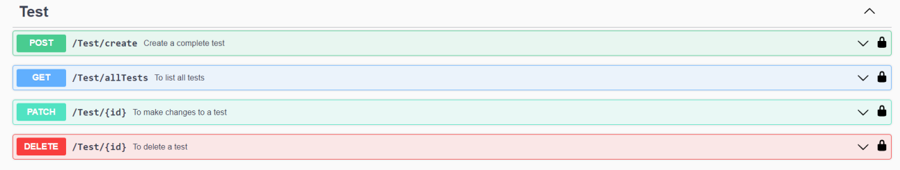
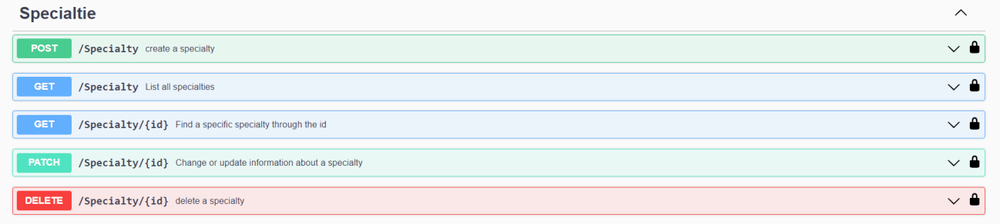
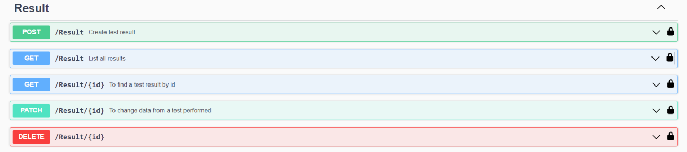

# API

A construção da API da aplicação se baseia no método Rest utilizando o Nest.js como Back-end na construção das Models, Services e Controllers do projeto em conjunto com o Swagger para testar cada rota montada para API. Todas as rota seguem o padrão de CRUD, e algumas dessas são rotas mais voltadas para testes de desenvolvimento, não se encontrando dentro da aplicação final do cliente.

A API dentro do Swagger é dividida em vários Schemas que favorecem o funcionamento de toda a aplicação.

<figure><figcaption></figcaption></figure>

Certos componentes das rotas necessitam de uma chave de autorização para que o usuário possa acessar a requisição de cada rota. Para ter esse acesso é necessário que o usuário crie sua conta para poder fazer o login no Swagger e através do token que o mesmo recebe ao realizar o login, poder ter acesso a alguma das rotas ao colar ela na opção de Authorize.&#x20;

<figure><figcaption></figcaption></figure>

Certas rotas vão ser obrigatórias ter acesso de administrador dentro do sistema caso queira acessa-las.

Logo abaixo se encontra o formato de cada schema com todas as suas rotas interligadas pelo Prisma ORM como todos os fluxos para usuários (User), testes realizados (Test), especialidade (Specialtie) e resultados dos testes (Result).

<figure><figcaption></figcaption></figure>

<figure><figcaption></figcaption></figure>

<figure><figcaption></figcaption></figure>

<figure><figcaption></figcaption></figure>

Cada descrição da rota representa a sua funcionalidade dentro da aplicação e do envio dos emails.&#x20;
