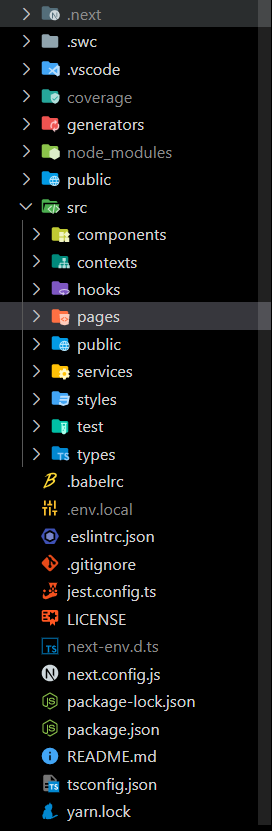

# Estruturação

A plataforma como padrão vem com um usuário cadastrado com funções de Administrador, podendo dar o acesso necessário a plataforma para os colaboradores do seu setor, inclusive adicionar novos administradores na aplicação. Após a instalação na parte onde é feito todas as interligações da API pelas rotas no Swagger ou até mesmo dentro dos arquivos no banco de dados, o profissional com acesso ao perfil poderá ditar quais dos novos perfis poderá ter acesso as configurações administrativas dentro da aplicação como um todo, desde as trocas de informações na API e no banco quanto também no site para a visualização dos históricos de todos os usuários da plataforma, essa ultima configuração pode ser filtrada dentro de cada aba de histórico na página do **Administrador.**

Para os novos usuários, é necessário fazer o registro de forma normalmente colocando preenchendo todos os campos obrigatórios. Após o preenchimento, o usuário deve confirmar essas informações através do link enviado no email que o usuário cadastrou para confirmar o seu login. Perfis de administradores podem confirmar o acesso também através das informações salvas na API ou no banco.

Após o login os usuários já terão acesso a boa parte da aplicação, sendo algumas exclusivas para administradores, e com a possibilidade de realizar os testes propostos e os administradores podendo realocar seus colaboradores dentro de suas funções e equipes divididas dentro do setor.

\_\_\_\_\_\_\_\_\_\_\_\_\_\_\_\_\_\_\_\_\_\_\_\_\_\_\_\_\_\_\_\_\_\_\_\_\_\_\_\_\_\_\_\_\_\_\_\_\_\_\_\_\_\_\_\_\_\_\_\_\_\_\_\_\_\_\_\_\_\_\_\_\_\_\_\_\_\_\_\_\_\_\_\_\_\_\_\_\_\_\_\_\_\_\_

### Testes

Conforme mostrado na **Introdução,** os teste são divididos em perguntas chaves com o objetivo de avaliar cada categoria de competências do colaborador. Cada pergunta equivale a 1 ponto de cada categoria, e as funcionalidades do teste se baseiam no tipo opção que será escolhida. Caso o usuário marque como **Não** uma das perguntas ele será redirecionado para a próxima categoria de perguntas, pois ao afirmar essa opção, diz que caso o profissional não tenha total conhecimento sobre uma das afirmações é entendido que o mesmo não irá saber responder as próximas, já que a estruturação do teste e de avaliação feita para seus gestores, se baseia em o profissional ter experiência de cada um dos processos de forma estruturada e linear.

Cada teste realizado possuem um prazo de realização de até 3 meses, permitindo o usuário realizar um novo teste após esse período. Outro meio é através do administrador que pode solicitar um novo teste para seu colaborador, realizando o teste com uma supervisão de seu administrador.  &#x20;

Os níveis de hierarquia de cada profissional são baseados através da soma de todos os testes, tirando assim um media que faz um comparativo no sistema para mostrar o seu nível junto com os gráficos de resultados da cada categoria.

Perfis de administradores também pode alterar os resultados dos testes de cada usuário e até o tipo de hierarquia de cada perfil caso não condizem com suas expectativas.

\_\_\_\_\_\_\_\_\_\_\_\_\_\_\_\_\_\_\_\_\_\_\_\_\_\_\_\_\_\_\_\_\_\_\_\_\_\_\_\_\_\_\_\_\_\_\_\_\_\_\_\_\_\_\_\_\_\_\_\_\_\_\_\_\_\_\_\_\_\_\_\_\_\_\_\_\_\_\_\_\_\_\_\_\_\_\_\_\_\_\_\_\_\_\_

### Tipos de gráficos

Boa parte da aplicação é formada por diferentes modelos de gráficos com diferentes meios de visualização, mostrando desde a parte mais relevante para seus colaboradores como seu histórico de evolução de forma aglomerada e dividida em cada categoria de perguntas , comparativo entre diferentes hierarquias conforme resultados dos teste e também no comparativo entre todos os usuários e equipes cadastradas pelos administradores.&#x20;

\_\_\_\_\_\_\_\_\_\_\_\_\_\_\_\_\_\_\_\_\_\_\_\_\_\_\_\_\_\_\_\_\_\_\_\_\_\_\_\_\_\_\_\_\_\_\_\_\_\_\_\_\_\_\_\_\_\_\_\_\_\_\_\_\_\_\_\_\_\_\_\_\_\_\_\_\_\_\_\_\_\_\_\_\_\_\_\_\_\_\_\_\_\_\_

### Estruturação dos códigos

Cada função da aplicação de desenvolvimento, back-end e front-end, estão separados em diferentes pastas cujo cada pasta nomeada armazena os arquivos que cuidam de cada uma funcionalidade do projeto.

Toda a infraestrutura da aplicação do cliente é em diferentes **componentes** (Components) onde estão os gráficos, as funcionalidades dos questionários do teste e outras funcionalidades do projeto. Já outras pastas como as rotas de cada página (Pages), os estados globais da aplicação (Contexts) e o arquivo de conexão com o servidor (Services) se encontram dentro da pasta Source (Src) do projeto para fazer a divisão entre os arquivos de configurações da aplicação de desnvolvimento para os de funcionalidades com a aplicação visual.

<figure><figcaption></figcaption></figure>

Já os arquivos de configuração do servidor com o banco de dados e da API são melhores detalhados na documentação do Compodoc do repositório Back-end e na seção da API.

&#x20;\_\_\_\_\_\_\_\_\_\_\_\_\_\_\_\_\_\_\_\_\_\_\_\_\_\_\_\_\_\_\_\_\_\_\_\_\_\_\_\_\_\_\_\_\_\_\_\_\_\_\_\_\_\_\_\_\_\_\_\_\_\_\_\_\_\_\_\_\_\_\_\_\_\_\_\_\_\_\_\_\_\_\_\_\_\_\_\_\_\_\_\_\_\_\_

### Identidade visual

O projeto é compostos por cores com um tom mais azulado e roxo claros e escuros tanto nos modelos White Mode e Dark Mode. O projeto como principio é baseado na identidade do site da empresa Petlove, com o intuito de ser um site que se encaixa com seus visuais e princípios, desde as cores, os fundos e os ícones. &#x20;
